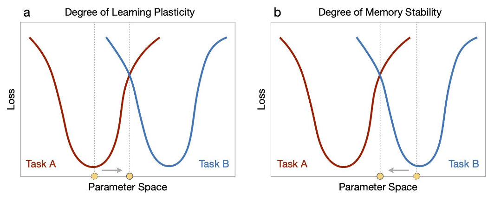
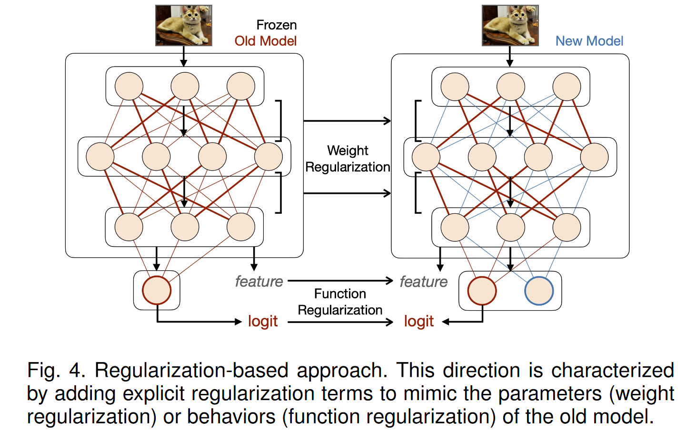
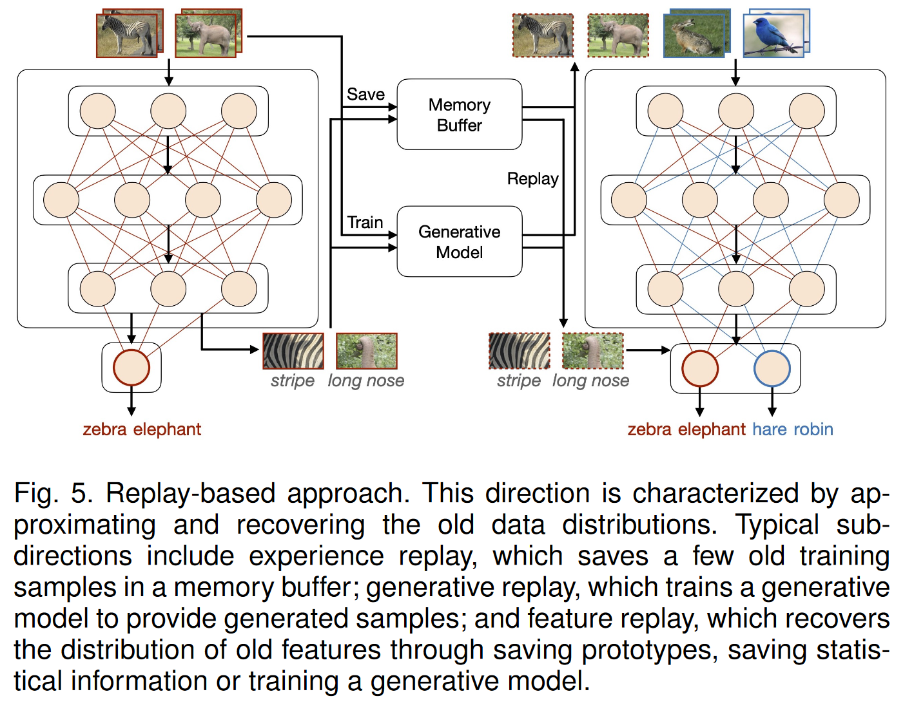
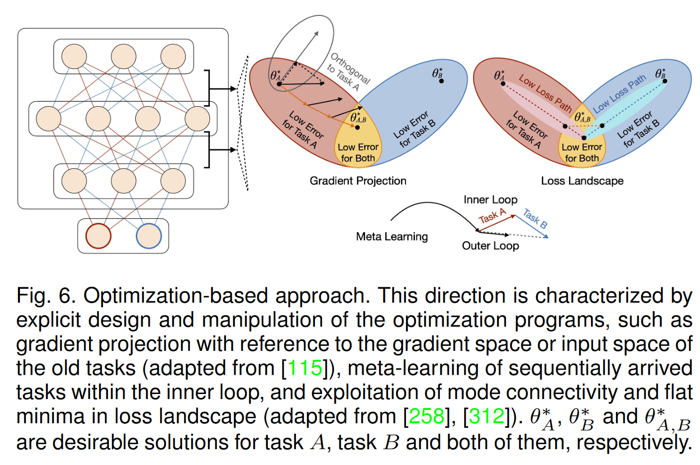
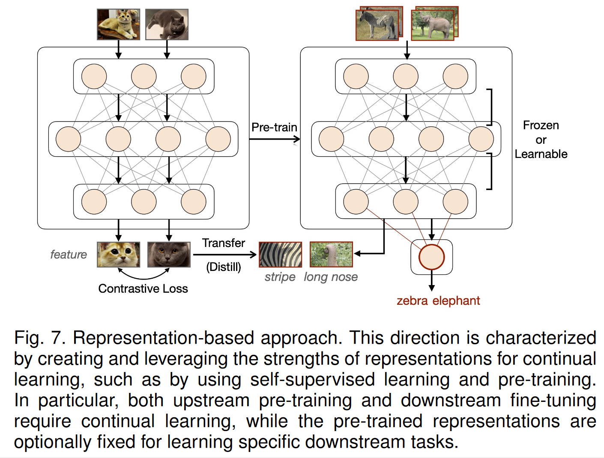
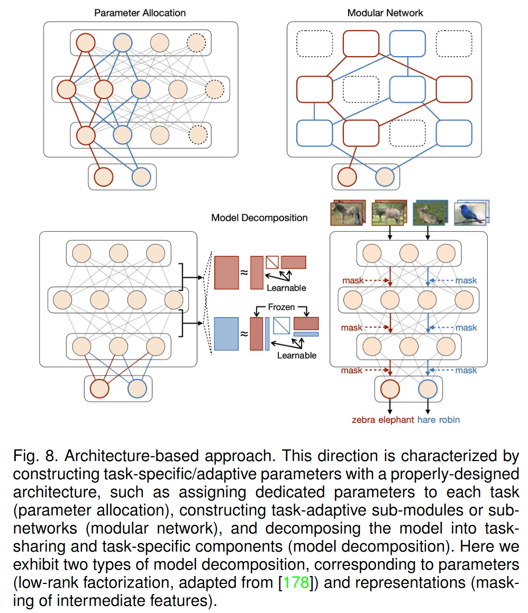

### 增量学习

##### 近似等价概念

- 持续学习
- 终身学习

##### 任务建模

- 从概率分布的角度，增量学习的主要目的是**结合增量样本和已有模型得到所有样本/任务的总体概率分布**：令$D_t =\{(x_t, y_t)\}_{n=1}^{N_t}$, $(t=1,\dots,k, k$为任务数)表示任务t对应的训练样本，则学习目标是得到一个在任务1~k中都能有不错表现的概率模型：
  - $p(D_{1:k}|\theta)=\prod_{t=1}^kp(D_t|\theta)$（假设条件独立）
- 而根据贝叶斯定理，基于网络参数的先验p(θ)，观察第k个任务后的后验满足：
  - $p(\theta|D_{1:k})\propto p(\theta)\prod_{t=1}^kp(D_t|\theta)\propto p(\theta|D_{1:k-1})p(D_k|\theta)$
- 其中其中第k-1个任务的后验$p(\theta|D_{1:k−1})$成为了第k个任务的先验，从而能够仅使用当前训练集$D_k$计算新的后验$p(\theta|D_{1:k})$。
- 然而一般很难确定一个后验概率分布的具体密度函数，因此一般采用近似的方式，主要有
  - 拉普拉斯近似
  - 变分推理近似
  - Gibbs采样近似

##### 典型场景

- 实例增量学习：所有训练样本属于同一个任务，分批到达
- 域增量学习：不同任务有同样的标签空间，但有着不同的输入分布
- 任务增量学习：不同任务有不同的标签空间，训练和测试中有标识符区分不同任务
- 类增量学习：不同任务有不同的标签空间，仅训练过程会告知当前样例属于哪个任务
- 无任务增量学习：不同任务有不同的标签空间，训练/测试过程不会告知当前样例属于哪个任务
- 在线增量学习：不同任务有不同的标签空间，每个任务的训练样本以数据流的形式一次性到达
- 模糊边界增量学习：不明确区分不同任务，不同任务具有不同但相交的数据标签空间
- 增量预训练：预训练数据分批到达

##### 性能指标

令$a_{k,j}$表示模型在经过k个任务的增量训练后在j任务上的准确率，则对于第k个任务

- 综合表现：
  - 平均准确度(AA)：$AA_k=\frac{1}{k}\sum_{j=1}^ka_{k,j}$
  - 平均增量准确度(AIA)：$AIA_k=\frac{1}{k}\sum_{i=1}^{k}AA_i$
- 记忆稳定性：
  - 遗忘度量(FM)：令$f_{j,k}=\max_{i\in\{1,\dots,k-1\}}(a_{i,j}-a_{k,j})\ \ \forall j\lt k$，则$FM_k=\frac{1}{k-1}\sum_{j=1}^{k-1}f_{j,k}$
  - 后向转移(BWT)：$BWT_k=\frac{1}{k-1}\sum_{j=1}^{k-1}(a_{k,j}-a_{j,j})$
- 学习可塑性：
  - 不变性度量(IM)：令$a^*_k$表示使用第k个任务的数据训练的参考模型具有的分类准确度，则$IM_k=A^*_k-a_{k,k}$
  - 前向转移(FWT)：令$\tilde{a}_j$表示使用第j个任务的训练数据训练的参考模型，则$FWT_k=\frac{1}{k-1}\sum_{j=2}^k(a_{j,j}-\tilde{a}_j)$

##### 主要挑战

- 稳定性和可塑性的矛盾：二者此消彼长，过于稳定会导致在新任务上欠拟合，过于可塑会导致灾难性遗忘
- 

##### 常用方法

- 基于正则的方法：在旧模型的基础上加入正则项
- 
  - 权重正则化：为权重参数添加二次正则项
  - 函数正则化：知识蒸馏
- 基于重放的方法：近似旧数据分布
- 
  - 经验重放：将部分旧训练样本保存在缓存区中，重点在与有效构建和利用缓存区，可以与知识蒸馏结合起来。
  - 生成重放：利用旧数据训练生成模型进行重放
  - 特征重放：通过存储模型原型、存储统计信息，或训练一个生成模型；具有隐私方面的优势。
- 基于优化的方法：显式地控制优化过程
- 
  - 梯度投影：利用正交投影，减少新旧任务梯度之间的相互影响，或利用旧任务与新任务梯度方向相同的分量辅助学习新知识
  - 元学习
  - 从损失函数分布的视角进行优化
- 基于表示的方法：尝试学习稳定且良分布的表示
- 
  - 对比学习为代表的自监督学习：自监督学习能更好减少灾难性遗忘
  - 预训练：针对需要增量学习的任务，在其上游使用预训练增强知识迁移能力并减轻灾难性遗忘。
  - 持续预训练：在上游的预训练部分也利用增量训练的方法，如元学习+预训练
- 基于结构的方法：构建具有合适结构、可适应不同任务的参数
- 
  - 模型分解：将模型区分为所有任务共享的固定部分，和针对单个不同任务的可扩展部分
  - 模块化网络：不在训练开始前显式地区分共享和独立部分，而是为每个任务分配一个相同的子网络，多个子网络分别利用任务对应的样本并行训练
  - 选择合适的基础网络结构
