##### Incremental Graph Convolutional Network for Collaborative Filtering

- 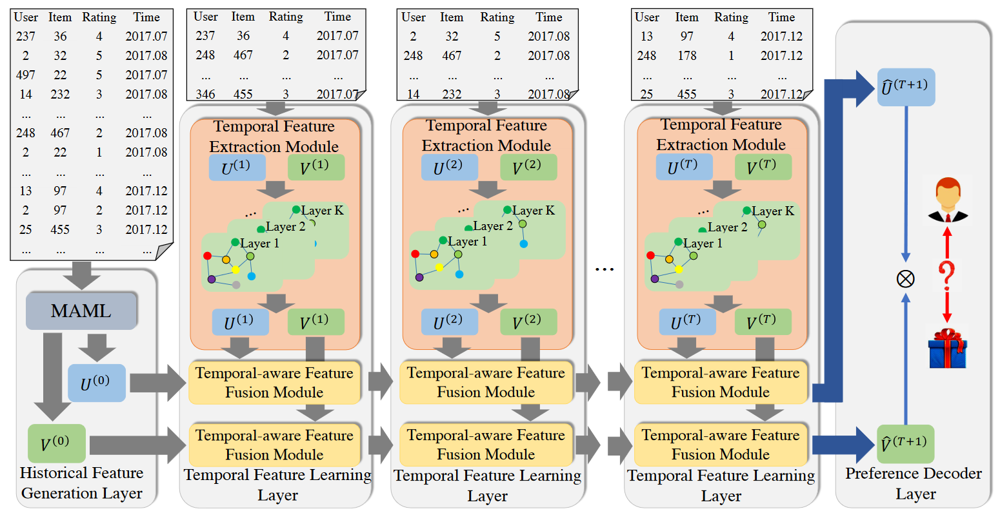
- **利用元学习初始化嵌入，融合新旧交互的时间信息**：用元学习的方式生成初始嵌入，缓解冷启动问题并确保快速模型适应；在此基础上引入时间特征学习层，通过增量时间卷积融合来自上一个子图（一个时间段中的用户-物品交互构成的图）和当前子图的嵌入网络。
- 思路：
  - 现实环境中，用户不断与项目交互，不断更新用户-项目交互图，使得原有训练好的GCN很快过时。
  - 包括重训练、引入RNN等现有的更新GCN的方法都存在诸如训练成本高、遗忘重要信息的问题。
- 个人评价：时间特征学习层（Temporal Feature Learning Layer）的层数取决于选取的总时间窗口大小，以及子图的划分，文中没有讨论TFL层层数的改变对整体模型性能带来的影响。然而时间窗口的大小和子图的划分决定了每层能够提取到的时间特征质量：当每个子图中结点过少时，可能导致欠拟合；因为每一层都会涉及大量的卷积操作，当划分子图过多时，会大大降低模型的效率。

##### FIRE: Fast Incremental Recommendation with Graph Signal Processing

- **使用基于图信号处理的非参数方法**：使用基于矩阵运算的的图信号处理方式，将用户-项目交互建模为矩阵，利用图信号处理的方式对矩阵进行分解、相乘等操作，不需要通过反复训练更新大量参数，从而可以快速从新的数据中获得更新；加入了时间感知过滤器和辅助信息过滤器，从而增加了时间感知能力和应对冷启动的能力。
- 思路：
  - 推荐系统本质是增量的：不重新训练，只依靠不断更新的用户/项目信息完成推荐
  - 从时间交互图中捕获的用户/项目的时间动态可以帮助对应的用户/项目嵌入与图结构一起发展。
  - 现有基于图的IR训练耗时，且难以处理新用户/项目，也即冷启动问题。
- 个人评价：令$R\in {0,1}^{m\times n}$，表示n个用户与m个项目的交互矩阵，$\tilde{R}=D^{-\frac{1}{2}}_URD^{\frac{1}{2}}_I$为归一化后的R，其中$D_U=Diag(R\cdot1), D_I=Diag(R^T\cdot1)$。文中给出的基础用户行为预测的计算公式为$p_u=r_u(\tilde{R}^T\tilde{R}+\alpha D_I^{-\frac{1}{2}}\bar{U}\bar{U}^TD_I^{\frac{1}{2}})$，其中$r_u\in R^n$是用户u与所有项目的交互，$\bar{U}是\tilde{R}$前K个奇异向量。可以看到模型用到的信息非常简单，仅有用户-项目交互的0-1矩阵，在推荐过程中没有其他信息的加入，因此模型的拟合能力是受限的，即使作者在此基础上引入了时间信息矩阵和辅助信息矩阵，应对复杂场景的推荐性能可能不如神经网络；同时，该模型的改进空间有限，因为虽然没有反向传播的时间开销，但如果需要继续加入额外信息，就需要添加新的矩阵，而不同矩阵之间都会进行大量的乘法运算，完成推荐所需的时间就会大量增加，从而降低用户体验。

##### Causal Incremental Graph Convolution for Recommender System Retraining

- 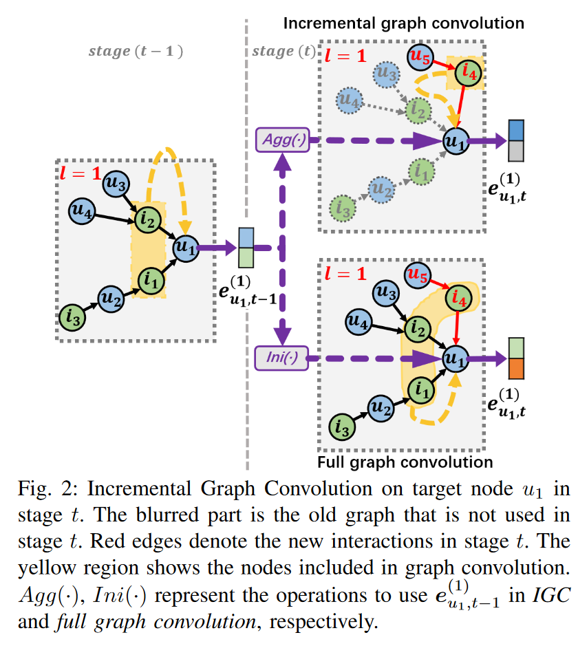
- 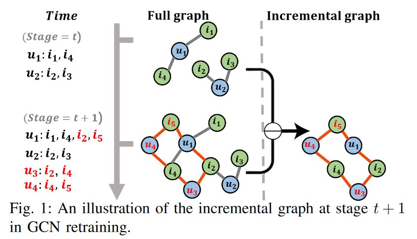
- **仅使用增量数据调整模型**：利用增量图卷积算子融合新旧表示（仅聚合增量中产生的新邻居，拼接旧表示与增量表示，并利用一个可学习的权重矩阵来决定新旧表示的重要程度，最后进行池化操作，期间只有与新邻居相关的参数是可训练的），并根据因果图中的碰撞效应（两个原本相互独立的事件(M,G)，但如果两者都可以导致另外一个事件(S)发生，表示为M→S←G，S为碰撞者，此时若知道M的情况，则可一定程度上得知G的情况），设计了碰撞效应蒸馏算子，通过控制碰撞器来估计新数据对不活动节点表示的因果影响，从而避免不在增量图中的非互动结点的过时问题。
- 思路：
  - 合并所有新旧数据，将模型完整重新训练效果很好，但成本非常高，且会随着时间不断增加。
  - 通过构建具有新交互的训练示例，对旧模型进行微调的成本相较完整训练更少，但由于还需要使用旧图更新参数，成本依然很高。
  - 仅利用新的交互来训练模型和图卷积。由于增量图较为稀疏，因此对计算资源的需求很小。但这样可能会切断旧图中的某些连接，容易产生过拟合和灾难性遗忘。
  - 高效的GCN推荐器再训练需要能够分离旧图、保留现有长期偏好、以及融合新旧偏好信号。
- 个人评价：该模型的增量卷积算子在融合新旧表示的过程中，增量表示添加到旧表示之后的总体表示实际上是隐含了时序信息在里面的（在末尾的表示越新，在开头的表示越旧），但随后的池化操作可能会将这一信息抹去（因为池化操作就是采样，实质来说就是用一个新的值(平均值/最大值)来表一片区域的值），因此池化的方式和池化的尺寸选择十分重要，而作者并未在文章中提到这一点。

##### Graph Structure Aware Contrastive Knowledge Distillation for Incremental Learning in Recommender Systems

- 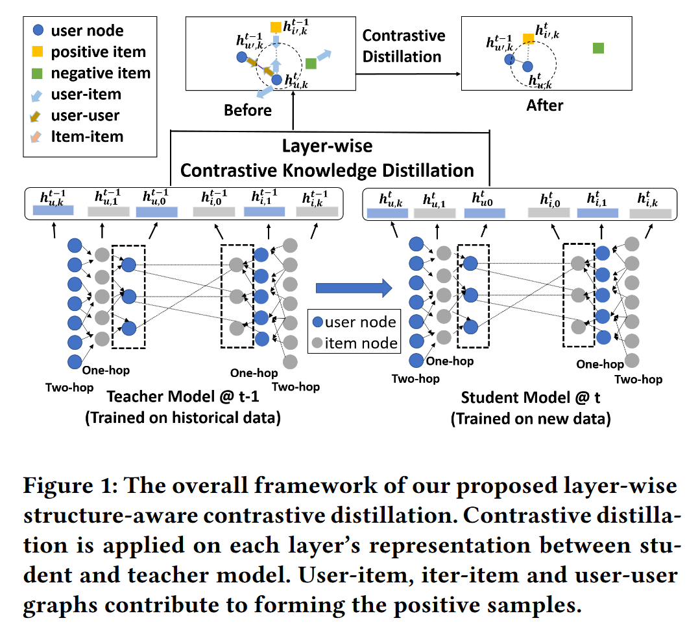
- **结合对比学习和知识蒸馏，引入分层蒸馏**：结合对比蒸馏（最小化教师和学生对相似输入给出的表示间的距离，最大化教师和学生对不同输入给出的表示间的距离）和分层蒸馏（允许保留不同大小感受野下的表示），从而注入层级监督，使得学生网络学习到捕获高阶关系的能力。
- 思路：
  - 知识蒸馏/正则化是增量学习中常采用的方法，而现有利用知识蒸馏的工作也继承了知识蒸馏的缺点：由于学生网络结构通常更加简单，因此难以捕获高阶依赖关系。
  - 保留中间层的表示通常具有更宽泛的接受域(涵盖更多跳的邻居信息)，能更好地保留模型属性，但很少在现有工作中被使用。
- 个人评价：该模型是从解决经典知识蒸馏模型中存在问题的角度出发，结合了对比学习和知识蒸馏，但仅仅是从模型的角度进行了优化，忽略了表示/嵌入方面的改进，如其他很多文章中都提到的上下文信息、序列（时间）信息等。

##### CPMR: Context-Aware Incremental Sequential Recommendation with Pseudo-Multi-Task Learning

- 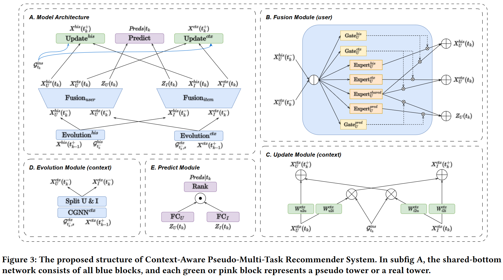
- 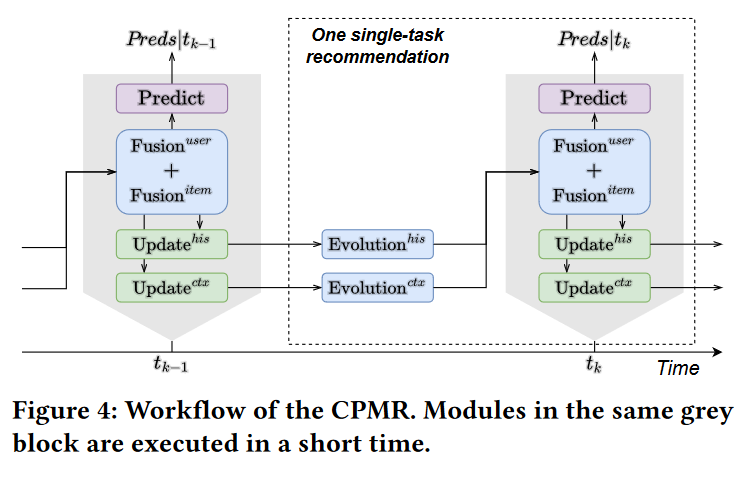
- **构建多视图表示，将多个增量单目标堆叠为多目标任务联合优化**：分别在静态嵌入、历史时间状态(已发生的所有交互)和上下文时间状态(固定大小的滑动窗口内的所有交互)下为每个用户/项目创建三种表示；将增量单目标推荐堆叠到一个多任务学习中联合优化，提高时间状态演化和增量推荐的性能；将模型的增量更新分为两部分，一是新增量到达时的更新（$t_{k-1}^+ \rightarrow t_k^- $），二是增量之间进行的更新（$t_k\rightarrow t_k^+$）。
- 思路：
  - 除了交互本身，交互的时间戳也能提供时间动态方面的信息。
  - 现有方法无法捕捉随时间变化的兴趣动态，忽略了最近的上下文对用户动态兴趣的影响。
- 个人评价：该模型创新点在于将历史、上下文信息的更新独立出来，与静态嵌入的更新一同作为一个伪多任务学习的任务，优化的着重点在于表示/嵌入的提取方式上，此外，也将增量更新分成了两个阶段，在不影响增量更新的前提下增加了增量推荐时的响应速度。但**该模型用到的历史状态图需要保存已发生的所有交互，这会随着时间推移不断增大**，最终导致更新缓慢，计算开销增加，可以考虑引入图知识蒸馏的方式来维护一个大小合适的历史图。

##### Contrastive Meta Learning with Behavior Multiplicity for Recommendation

- 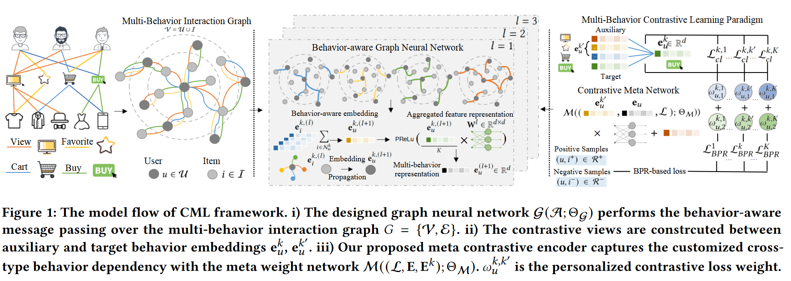
- **结合对比学习与元学习**：利用对比学习从不同行为视图中捕获跨类型的交互，提取额外的监督信号；利用对比元网络编码不同用户的定制行为异质性，提升模型适应新用户的能力。
- 思路：
  - 实际推荐场景中，用户和项目之间存在多种类型的交互，不同类型的交互可以相互补充、从不同的维度表示用户偏好，而大多现有模型假设仅有一种类型。
  - 目标行为类型的交互通常很少，缺乏监督信号。
  - 多行为的模式可能因人而异，使用相同的用户-项目关系建模会导致次优的结果。
- 个人评价：该模型将一个用户的行为继续细分为不同类型的行为进行建模，并将一段时间内的不同行为视作上下文信息进行考虑，然后将不同类型的行为表示聚合成最终表示。但论文中聚合用户多行为表示的方式是：$e^{(l+1)}_u=PReLu(W^l\cdot\frac{\sum_{k\in K}e_u^{k,(l+1)}}{K})$，其中$K$为用户行为类型的数量，$e_u^{k,(l+1)}$表示用户u在l+1层中的第k种行为的嵌入。可以看出该模型**没有考虑对到不同行为赋予不同的权重**，如用户的“收藏”行为一般来说比“浏览”行为表现出更多的购买欲望，因此可以考虑换成可训练参数。

##### Structure Aware Incremental Learning with Personalized Imitation Weights for Recommender Systems

- 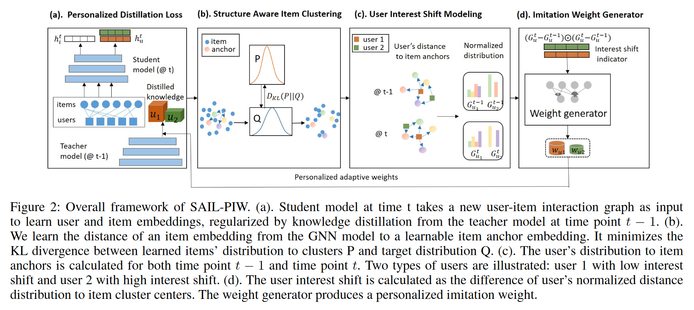
- **个性化历史信息权重**：利用状态向量经过权重生成器，生成用户特定的模仿权重，模仿权重决定学生模型要从教师模型中继承多少与用户相关的历史信息。
- 思路：
  - 应对增量问题，知识蒸馏在效率和性能方面都具有优势，传统方法一般为所有用户保留相同数量的历史信息。
  - 不同用户的兴趣变化可能不一样，有些相对固定、少有增量信息，此时应尽可能保留多的历史信息；而有的经常改变，最近的行为更能反应用户的兴趣，应个性化地设计。
  - 知识蒸馏目标函数中的超参数“模仿权重”对实现个性化的历史数据保留有重要作用。
- 个人评价：个性化的历史信息保留权重是该模型的主要创新点，也是整篇文章着墨最多的点，但在模型中的实现却十分简单：传统基于知识蒸馏的增量学习损失可表示为$\mathcal{L}_S=\mathcal{L}_{new}(\mathcal{y}S,\tilde{\mathcal{y}}S)+\mathcal{L}_{KD}(\mathcal{\tilde{y}}T,\tilde{\mathcal{y}}S)$，其中$\mathcal{L}_{new}$为学生模型在增量训练上的损失，$\mathcal{L}_{KD}$为学生模型和教师模型的蒸馏损失。在本文中，作者将$\mathcal{L}_{KD}$替换为$\mathcal{L}_{KD-PIW}^U+\mathcal{L}_{KD}^I$，其中$\mathcal{L}_{KD}^I$为物品的蒸馏损失，$\mathcal{L}_{KD-PIW}^U=\sum_{u\in U}w_u\mathcal{L}_{KD}^u(\mathcal{\tilde{y}}_uT,\tilde{\mathcal{y}}_uS)$为用户表示的蒸馏损失，**这里的$w_u$就是作者添加的可训练的历史权重**。并且在实验部分选的baseline多为2020年的模型(该论文发表在AAAI2023上)，整体参考价值应该不高，但个性化的权重保留本身是个很好的想法，可以加在其他模型中。

##### Deployable and Continuable Meta-learning-Based Recommender System with Fast User-Incremental Updates

- 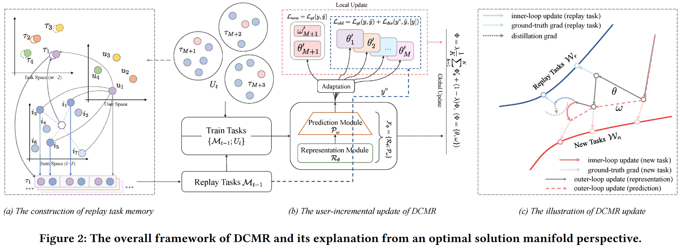
- **通过双约束任务采样器限制使用的内存**：用最小化蒸馏损失和面向反馈的蒸馏损失同时约束任务采样，结合任务重传播和一阶梯度下降实现快速的用户增量更新。
- 思路：
  - 大多数基于元学习的RS通过支持集和查询集估计二阶导数，导致更新时的计算负担很重。
  - 要实现可部署的元学习RS，需要满足：
    - 1)避免灾难性遗忘
    - 2)稳定快速地进行用户增量更新
    - 3)有限的内存消耗
    - 4)易于实现、易于计算。
- 个人评价：本文中，作者认为：随着不断的学习，模型已经获得了历史所有用户的总体分布，当历史用户数量足够时，该分布能反应所有用户的总体分布。因此在模型增量更新的设计中，**整体的学习率应随着时间的迁移而减小**。具体做法是利用基于动量的自适应控制器，学习率的计算表达式为$\lambda = \exp(-\eta\frac{t}{T})$，其中T是模型需要迭代的总次数，$0<t\le T$为当前更新的序号，$\eta$是超参数。该思想是符合增量学习的目标的，即获取接近总体的数据分布并利用该分布做出预测。但对于推荐系统来说，目标是在未来的任务中取得更好的表现。同时，对同一个用户来说，其最近的行为更能反映他接下来的偏好。因此**这种学习率衰减的做法会让模型忽略用户最近的行为**，从而可能产生次优的结果。

##### Learning an Adaptive Meta Model-Generator for Incrementally Updating Recommender Systems

- 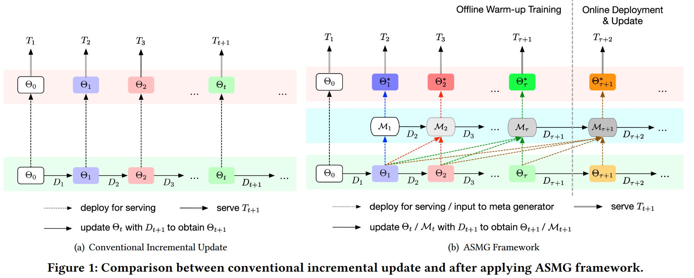
- 
- **使用元学习生成更好的模型，并保留上一阶段模型的隐藏数据**：当前周期的增量训练后，使用元学习器根据包括当前周期模型在内的k个历史增量模型，生成更好的模型；在每个增量训练周期开始时，使用上个周期学习到的隐藏状态作为该周期元生成器的初始隐藏状态，从而在使用截断序列训练元生成器时不会丢掉历史信息。
- 思路：
  - 增量数据与原模型使用的数据不同分布时，会产生灾难性遗忘问题。
  - 相比持续学习强调在不牺牲之前任务比表现的情况下有效应对新任务，而在推荐任务中更多关注未来的任务。
  - 现有基于模型的增量方法没有考虑模型演化中存在的长期序列模式的潜力。
- 个人评价：序列元学习(SML)是本模型的主要灵感来源，本文在传统序列元学习的基础上拓展了时间窗口(2→T)。该方法实质上就是在元学习的基础上，通过增加保留的历史信息(t个历史模型和t份历史增量数据)来提升性能，因此弊端也很明显：成倍提高了更新模型和存储的开销，但带来的性能提升却十分有限(见下图，AUC提升相较基线"IU"提升1%左右)。原因在于：对于最近的t个模型来说，它们的绝大部分参数都是相近的、对同一个输入给出的输出都是相同的，因此保存最近的t个模型中存在大量冗余的部分。
- 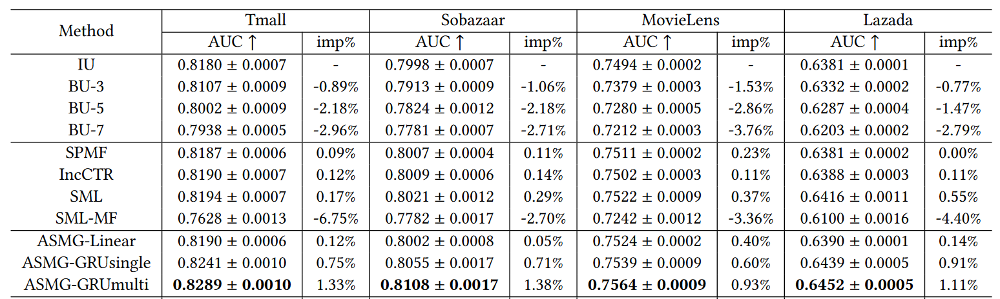
