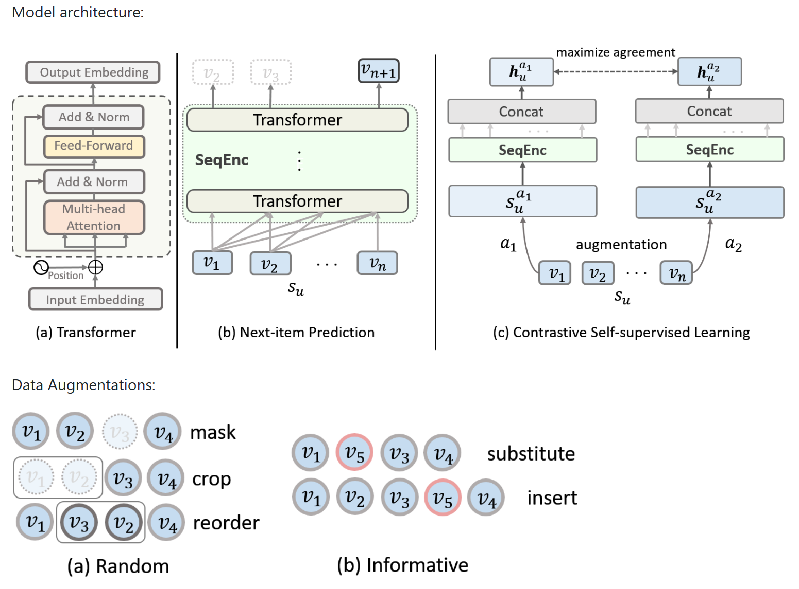
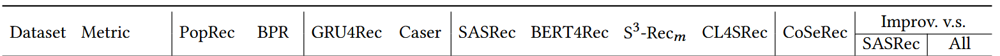
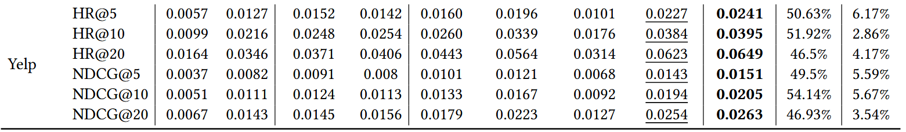
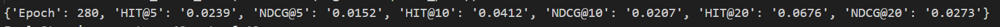
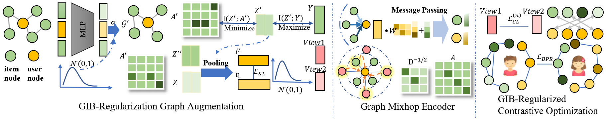
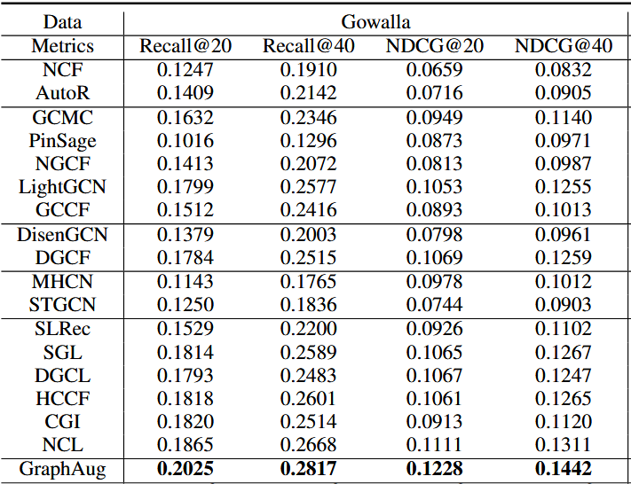
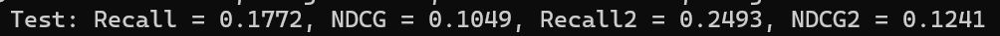
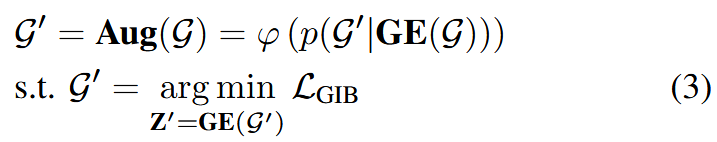
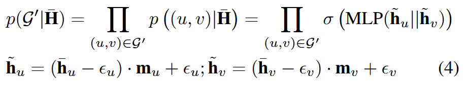

# Data Augment in Recommendation

### Contrastive Self-supervised Sequential Recommendation with Robust Augmentation

- **推荐任务**：序列推荐
- **复现结果**：表现基本与论文中给出的结果一致

- **现有问题**：
  - 随机增强可能会产生置信度不高的正对，因为这些项目的随机扰动会破坏序列中的项目关系。
  - 随机增强也会阻碍学习表示的质量，因为它们（例如裁剪）通常会导致序列中的项目较少，从而加剧了冷启动问题。
- **鲁棒性增强**：与随机增强不同，本文的信息增强在构建积极视图时利用项目相关性，从而更加稳健。此外，“替换”和“插入”操作都扩展了用户交互记录，从而缓解了冷启动问题。

### Graph Augmentation for Recommendation

- **复现结果**：效果较论文中给出的偏低
  
  
- **现有问题**：
  - 对比学习中缺乏对数据噪声的考虑可能会导致自监督信号产生噪声，从而导致性能下降。
  - 许多现有的 GCL 方法依赖于图神经网络 (GNN) 架构，该架构可能会因非自适应消息传递而遭受过度平滑问题。
- **GraphAug图增强框架**：采用了图信息瓶颈 (GIB) 正则化增强范式，鼓励相似节点的嵌入在嵌入空间中接近。利用该正则化技术对观察到的交互图进行去噪，并生成两个去噪增强图，即 G' 和 G''。两个增强图包括捕获高阶协作关系的附加边。可自动提取信息丰富的自监督信息并自适应调整对比视图的生成。
  首先初始化一个id对应的嵌入矩阵$H^{0}\in R^{(I+J)\times d}$，其中I和J分别表示图中用户和项目的数量，d表示嵌入维度。 $H^{0}$的每一行对应于用户u或项目v的初始嵌入向量，分别表示为$h^{0}_{u}$和$h^{0}_{v}$。随后，我们使用表示为GE的图编码器来生成高阶节点表示，从而得到矩阵$\hat{H}$ = $GE(H^{0})$

其中概率 $p((u, v)|\hat{H})$ 表示在给定用户和项目嵌入 H ̄ ∈ R(I+J)×d 的情况下，边 (u, v) 出现在增强图 G' 中的可能性。使用多层感知器 (MLP) 进行估计