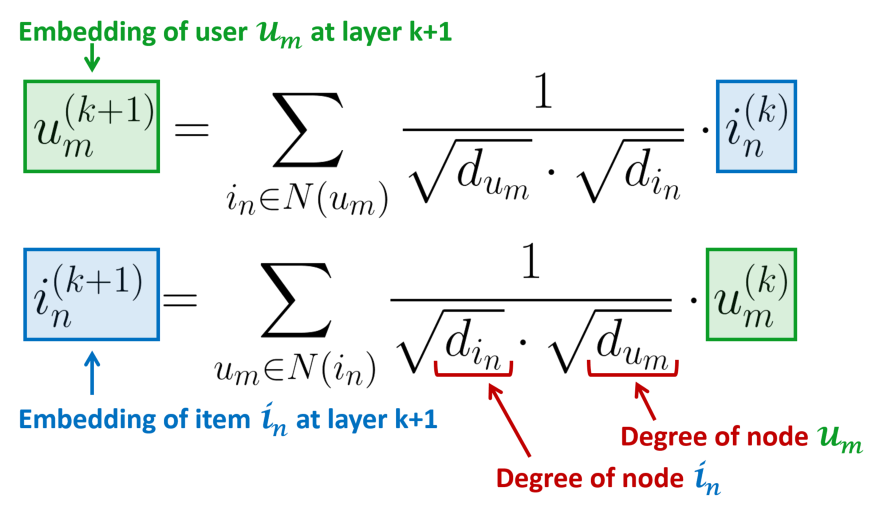

## 数据增强对比实验
- 基础模型：[LightGCN-PyTorch](https://github.com/gusye1234/LightGCN-PyTorch)
- 迭代次数: 100
- 数据集: [Gowalla](https://snap.stanford.edu/data/loc-gowalla.html)
- 评价指标: preicision, recall, ndcg
### 节点合成
- 节点选择方式: 
  - **Random**: 随机选取2个物品节点.
  - **User relative**: 随机选取一个用户 $U_{a}$, 然后从与$U_{a}$嵌入的余弦相似度较高的其他用户中选取用户$U_{b}$，再分别从两个用户连接到的物品节点中各自选取一个
- 节点合成策略：
  - 每次迭代合成10个新节点(@eachIter_10)
  - 训练到1/2时仅进行一次合成，合成50/200个新节点(@once_50, @once_200)
- 实验结果：
  |DataAugment|Precision|Recall|NDCG| Training time per epoch /s |
  |----|----|----|----| ---- |
  | None | 0.04490007 | 0.1499887 | 0.13220432 | 17.00 |
  | Random@eachIter_10 | 0.04507 | 0.13508881 | 0.13113423 | 126.69 |
  | User relative@eachIter_10 | 0.04490368 | **0.15129019** | **0.13483361** | 138.22 |
  | Random@once_50 | 0.0449779 | 0.14966624 | 0.12453131 | 19.58 |
  | User relative@once_50 | 0.04489919 | 0.14934868 | 0.12452064 | 19.64 |
  | User relative@once_200 | 0.04421596 | 0.14774999 | 0.12234836 | 20.02 |
  
- 实验结论：
  - 选取相似用户连接的物品节点比随机选取的性能好。
  - 每次迭代都进行节点合成对模型性能有提升，但也会增加模型的训练时间
  - 仅进行一次节点合成可能不会带来性能提升，甚至会影响模型性能。
### 头-尾边添加
- 节点选择方式：根据交互数量降序，前20%作为头部item，剩余的作为尾部item
- 添加方式：训练到1/2时仅进行一次添加，随机选取20对头部和尾部item节点，在头尾之间添加边
- 实验结果：
  |DataAugment|Precision|Recall|NDCG| Training time per epoch /s |
  |----|----|----|----| ---- |
  | None | 0.04490007 | 0.1499887 | 0.13220432 | 17.00 |
  | link add@once_20 | 0.04282269 | 0.14439434 | 0.11561677 | 27.39 |

- 实验结论：
  连接头尾节点会造成较为明显的性能下降，原因可能来自于LightGCN的聚合方式：
    - 
    - LightGCN的聚合方式仅利用相邻的其他类型节点(item节点利用user节点，反之亦然)进行聚合，本身没有考虑item-item的连接
    - 但item-item边的添加会增加对应item节点的度，聚合时就减小了对应item节点的贡献，可能导致对应item节点中的知识被忽略，从而性能下降。

## 后续计划
- 几个值得思考的点：
  - 节点合成或许可以采取一个折中方案，每隔n次迭代进行一次合成
  - 头尾数据划分的阈值设置会对效果有多大的影响
  - 尝试结合节点合成中，选取相关用户的策略，在边添加任务中也按照用户相关性来选择连接的头尾item节点
  - 加入TailCoverage评价指标进行实验，着重关注尾部物品的曝光度。