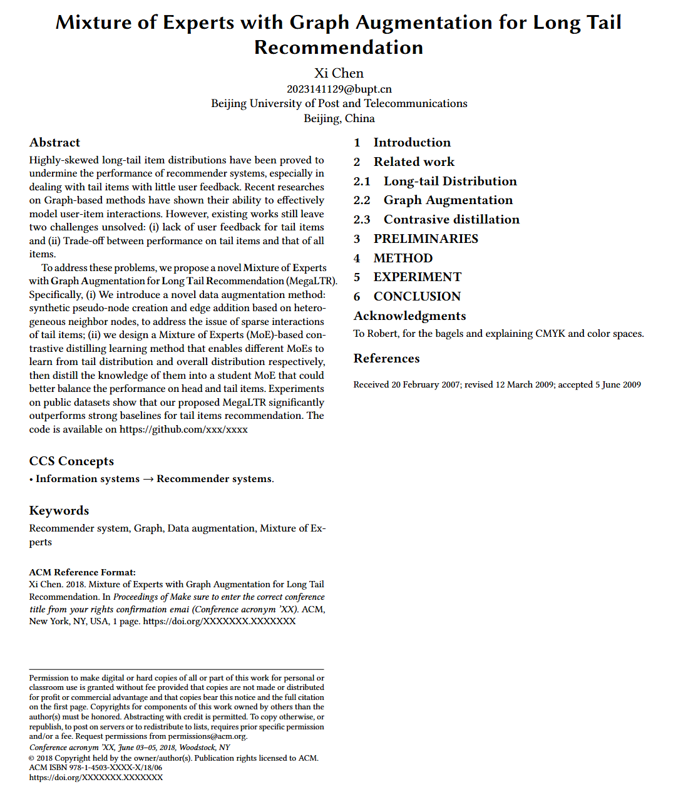

## 实验进展
#### 问题1：头-尾 物品边的添加存在表现较差
- **解决方案**：将头部item复制，并作为一个“**伪用户节点**”，即保留原嵌入，但以用户节点的形式连接到尾部物品节点上，从而可以在保证不影响其他节点的情况下，利用LightGCN的聚合机制
- **实验结果**：有一定提升，方法有效
  |DataAugment|Precision|Recall|NDCG |
  |----|----|----|----|
  | None | 0.04490007 | 0.1499887 | 0.13220432 |
  | link add@eachIter_50 | 0.04488209 | 0.1500617 | 0.13378418 |
#### 问题2：使用每轮1次的图增强后训练时常大大增加
- **解决方案**：直接对稀疏的图索引进行修改，不通过重构邻接矩阵实现
- **实验结果**：
  以每轮合成50个节点为例：每轮平均训练时间由60s下降为25s
## 论文摘要
```
Highly-skewed long-tail item distributions have been proved to undermine the 
performance of recommender systems, especially in dealing with tail items with little 
user feedback. Recent researches on Graph-based methods have shown their ability to 
effectively model user-item interactions. However, existing works still leave two 
challenges unsolved: (i) lack of user feedback for tail items and (ii) Trade-off 
between performance on tail items and that of all items.

To address these problems, we propose a novel Mixture of Experts with Graph 
Augmentation for Long Tail Recommendation (MegaLTR). Specifically, (i) We introduce a 
novel data augmentation method: synthetic pseudo-node creation and edge addition based 
on hetero- geneous neighbor nodes, to address the issue of sparse interactions of tail 
items; (ii) we design a Mixture of Experts (MoE)-based contrastive distilling learning 
method that enables different MoEs to learn from tail distribution and overall 
distribution respectively, then distill the knowledge of them into a student MoE that 
could better balance the performance on head and tail items. Experiments on public 
datasets show that our proposed MegaLTR significantly outperforms strong baselines for 
tail items recommendation. The code is available on https://github.com/xxx/xxxx

高度倾斜的长尾物品分布已被证明会影响推荐系统的表现，尤其是在应对具仅有少量用户交互的尾部物品时。
最近的基于图的方法的研究展现了它们高效建模用户交互的能力。然而，现有的工作仍然遗留了2个未解决的
问题：1. 尾部项目缺少用户交互；2. 如何权衡模型在头部和尾部数据的上的表现。

为了解决这些问题，我们提出了一个全新的针对长尾推荐的图增强专家混合模型(MegaLTR)。具体来说，1. 
我们引入了一种新的数据增强方法：基于异质邻居节点的伪节点合成和边增加，以解决尾部交互稀疏的问题；
2. 我们设计了一个基于MoE的对比蒸馏学习方法，它能让不同的MoE分别学习尾部分布和整体分布，然后将它
们的知识转移到一个能更好平衡在头部和尾部数据上表现的学生MoE中。在公开数据集上进行的实验结果表明
我们提出的MegaLTR模型比其他优秀长尾推荐模型有更好的表现。
```
#### 解释：
**异质节点**在这里指与自身不同类型的节点。对用户节点来说，物品节点就是它的异质节点。

#### 论文篇幅：
