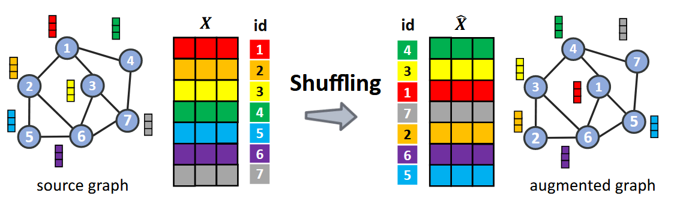
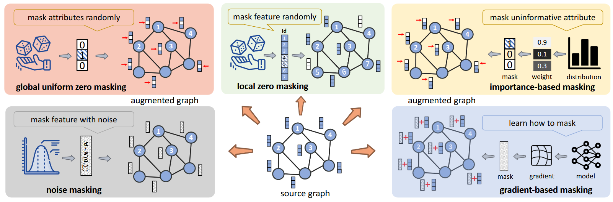
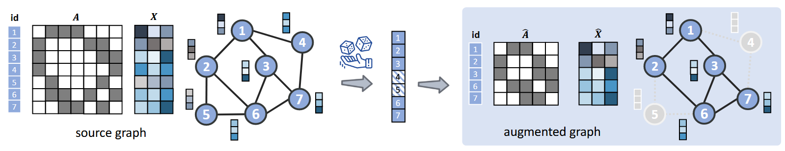
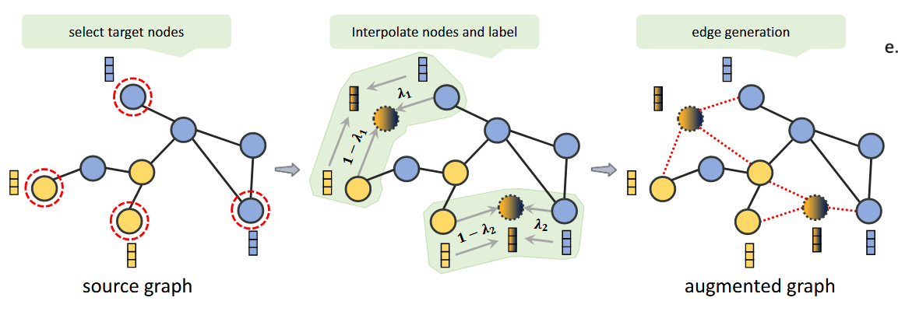
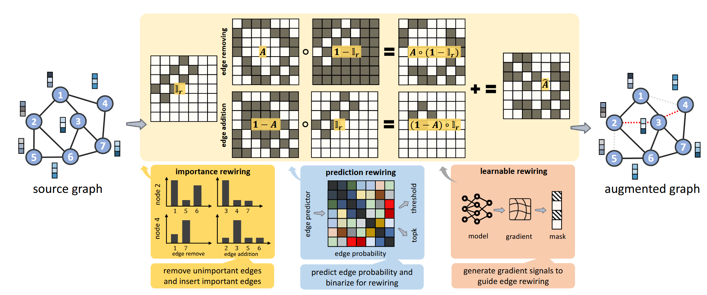
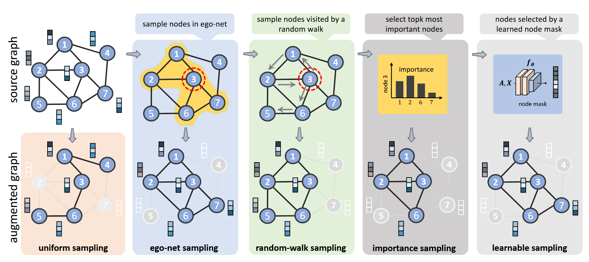
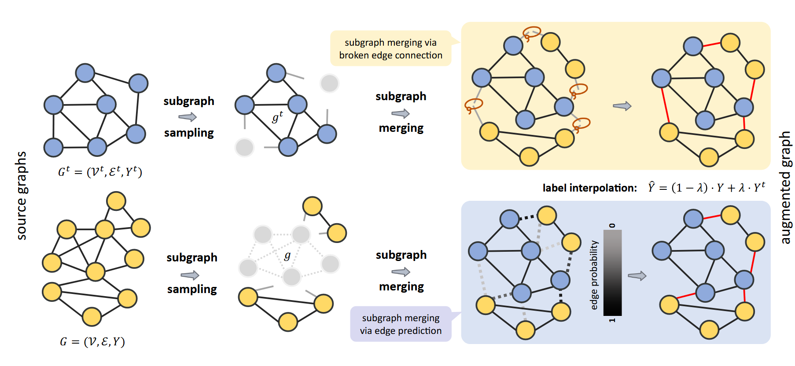
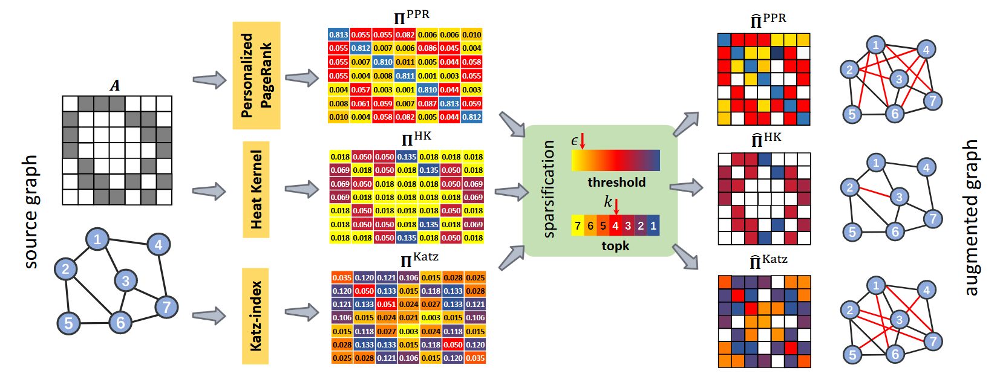
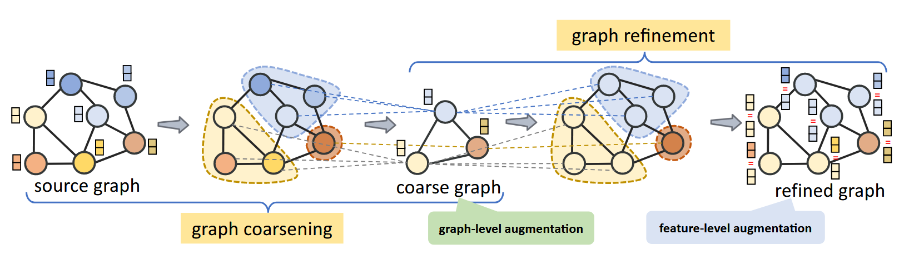

# Methods in Graph Augment

## 特征增强
- 特征交换 
  
- 特征掩盖
  
## 节点增强
- 节点删除
  
- 节点合成
  
## 边增强
- 边删除
- 边增加

## 子图增强
- 子图采样
  
- 子图替换 wasd
  
## 全图增强
- 图聚合
  
- 图粗化/细化
  

## 个人想法
- 节点合成
  - 从完整数据中选取(头部+尾部)
  - 分别从尾部和头部数据中随机选取一对相似的用户节点表示
  - 分别从头部和尾部用户直接相连的物品节点中随机选取一个，作为合成的源节点
  - 合成的节点连接到尾部用户