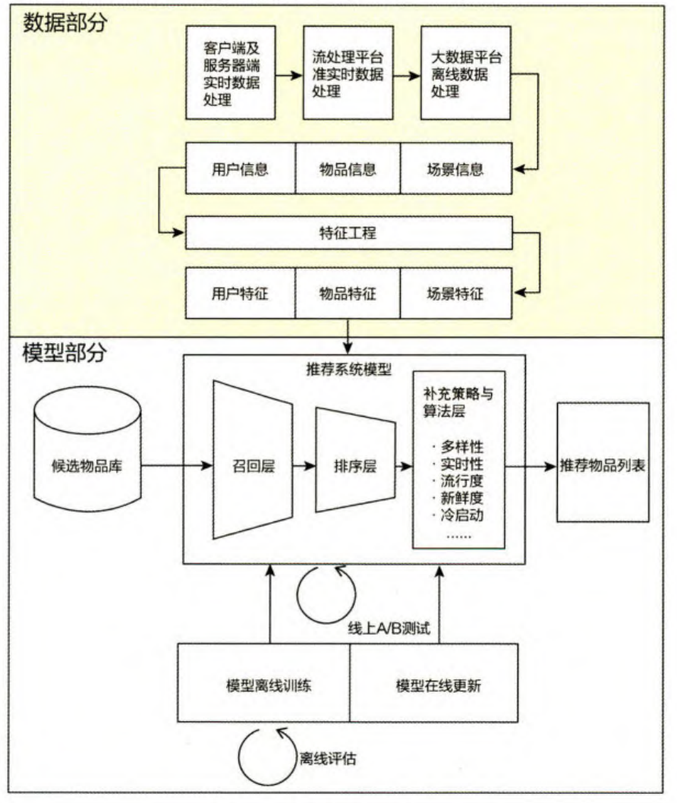

## 2023年秋季学期总结

本学期进行的主要工作是通过广泛、大量地粗读推荐系统领域的论文，对推荐系统的常用模型、方法和解决的问题有一定的了解，并且结合自身兴趣和能力选择一个细分方向，作为后续论文精读的主要方向。具体如下：

本学期主要看的论文方向有

- 对话推荐（20篇）
- 图相关的推荐（35篇）
- 增量推荐（13篇）

### 1. 推荐系统简述

在互联网高度普及的当下，推荐系统旨在解决“信息过载”，充分利用可获取的信息、通过高效的推荐算法甄选出用户最可能想要的项目/物品。王喆[^1]在《深度学习推荐系统》一书中指出，推荐系统一般分为**数据**和**模型**两个部分。数据包含了用户、项目、上下文和一些外部信息，以及针对它们的获取、特征提取过程；模型部分又可分为**召回层**、**排序层**和**补充策略与算法层**，整体结构如下图所示：

其中数据部分的特征提取和模型、特征组合和模型部分是推荐系统中的主要部分和重点。

### 2. 对话推荐

##### &#x2160;简述

对话推荐是一种基于对话系统和推荐系统的结合，旨在为用户提供个性化的、针对对话内容的推荐建议。它通过分析对话中的文本、用户偏好和上下文信息，利用推荐算法和机器学习方法，为用户推荐相关的对话内容、产品、服务或其他相关资源。可以应用于各种对话场景，如社交媒体对话、在线客服对话、论坛讨论等。

对话推荐相较于传统推荐系统，主要的区别在于对话推荐是通过与用户对话的方式，利用从用户得到的反馈进行推荐，可分为**用户交互模块**、**对话策略模块**和**推荐模块**三个主要模块。

对话推荐的优势在于能够根据对话上下文和用户需求，提供更加精准、个性化的推荐建议。它可以帮助用户更好地参与对话、获取所需的信息，提高用户满意度和体验。同时，对话推荐也对推荐系统的技术和算法提出了新的挑战，如上下文建模、语义理解、对话历史处理等方面的问题。

近两年对话推荐越来越多地受到关注。其主要使用的技术有强化学习和生成模型，得益于LLM的发展，基于LLM的对话生成能让对话更加自然，可以更深入地引导用户表达自己的偏好，相较于传统方法有着显著优势。但LLM对硬件有着较高要求，现有条件难以开展这方面的工作。

##### &#x2161;关键问题及现有方法

###### 模型架构和流程优化

对话推荐的推荐部分可以按照功能分为**目标规划**、**主题预测**、**项目推荐**和**响应生成**四个部分，Yang Deng[^2]等人注意到多轮对话推荐的四个任务之间存在着联系，只关注一个任务会限制最终的推荐效果因此需要一个统一的架构分别指导4个模块的实现，将四个模块放在同一个上下文中进行考虑。

在传统的对话推荐中，通常完成推荐一个项目后系统就会结束服务，而Ali Montazeralghaem[^3]等人认为这种方式不够灵活， 限制了用户更清晰的表达个人需求，并且只能进行单个项目的推荐，因此将传统的单次推荐后即结束的推荐流程拓展为被拒绝继续交互、且支持单次多项目推荐的流程。

###### 用户交互优化

CRS相较传统推荐，能通过主动对话引导用户表达偏好，并收集用户的实时的偏好。而这一优势能得到足够发挥的前提是对话代理能够提出足够优质的问题。现有CRS大多分为两类：基于策略的和基于知识图的，Xuhui Ren[^4]等人认为前者依赖训练语料库的质量，后者忽略了用户响应背后的语义，且效率较低。因此提出了基于知识的问题生成系统，利用知识图谱构建推荐组件，并且加入对异构关系的识别，从而帮助更好理解用户的决策过程、得到更有效和可解释的推荐。

###### 挖掘/细化交互信息

对于对话推荐，对话过程通常较短，对话中产生的交互信息是有限的，因此有效利用交互信息非常重要。对话中涉及到的信息按照其描述的对象可分为属性级信息和项目级信息，**属性级信息**表明了用户偏好/厌恶项目的共有属性，如“红色”、“实惠”等描述性的信息；而**项目级信息**则更加具有指向性，表明了用户偏好/厌恶的具体的某个或某些项目，如“苹果手机”、“康师傅泡面”等。一般来说，属性反馈反应用户偏好的特定方面，并且项目反馈难以利用，因为拒绝某个项目的原因可能多种多样，因此项目级反馈相较于属性级反馈通常更容易被忽视。Hu Chenhao[^5]等人认为，属性级和项目级信息是互补的，可以通过设置不同聚合粒度的方式利用两者之间的联系，从而实现更加准确的推荐。

###### 解决数据稀疏

数据稀疏问题非常广泛地存在于推荐系统领域中，因为总是会遇到新用户或新项目的场景，面对这些没有任何了解的用户/项目，能直接参考的信息仅有当前对话，或少数的近几段对话，从而导致了数据稀疏问题。Shuokai Li[^6]等人和Zhaochun Ren[^7]等人通过利用历史对话的方式，将历史对话中的其他相似用户、项目作为当前推荐的参考，并结合时序信息，得到更好的推荐效果。

冷启动问题存在于机器学习相关的各个领域中，而在推荐系统领域中，冷启动问题通常与由新用户、新项目带来的数据稀疏问题是基本等价的。针对冷启动问题，Xiaolei Wang[^8]等人使用基于采样的数据生成方式来进行数据增强，分别使用启发式采样、基于数据的采样和基于模型的采样三种方式组合生成模拟的对话数据；而Xia Yu[^9]等人则尝试从关键词项的角度去解决冷启动问题。关键词项即一段文字中最能表达用户偏好的中心词、关键词，虽然关键词项的引入已经被证明可以帮助解决冷启动问题，但作者在论文中指出关键词项的引入可能也会带来偏差，因此提出在引入关键词项前应先评估其中可能带来混淆的偏差，选出对模型性能真正有帮助的关键词项。

### 3. 基于图的推荐

##### &#x2160;简述

图是一种数据结构，由结点和连接结点的边组成。在推荐系统中，推荐项目和用户之间的关系是非常重要的因素，图可以很好地描述这一点，因此图可以广泛应用于不同的方面，如用户关系建模、物品关联分析和推荐路径发现等。

基于图的推荐系统可以捕捉到物品之间的复杂关联关系，不仅仅局限于简单的用户-物品关系。通过分析图中的边和节点之间的连接，可以发现隐藏的关联模式，提供更全面和准确的推荐。

##### &#x2161;关键问题及现有方法

###### 图结构的优化

在已有工作中，基于图的卷积神经网络，或者图卷积网络(GCN)，已被证明拥有很好的提取高阶关系的能力，因为卷积的过程可以很好地表示结点的多跳关系，但Huiyuan Chen[^10]等人指出，GCN会随着层数的增加，遇到训练效率低下，优化困难、过拟合、过度平滑、梯度消失等**瓶颈效应**。这是因为在图神经网络的训练过程中，随着网络层数的增加和迭代次数的增加，每个节点的隐层表征会趋向于收敛到同一个值。在他们的工作中提出将K-Means引入GNN，从而可以对库存进行以项目为中心的探索，并通过非局部注意力算子与GNN中的局部算子协作，避免GNN层数过深时产生的瓶颈效应。

超图是一种广义的图模型，允许边连接多个顶点，而不仅限于两个顶点之间的连接，这使得超图能够更好地表达复杂的关系和交互。在推荐系统中，超图不仅可以用来表示用户、物品和它们之间的关系，还能更自然地融合上下文信息。与传统的二分图相比，超图能够更全面地捕捉用户和物品的多样性和复杂性。Sen Zhao[^11]等人的模型中通过建立偏好、厌恶和社交关系三个超图，很好地融合了社会关系、用户-物品多重关系等多方面的信息；而Yinfeng Li[^12]等人认为，用户在某个会话中所体现出的兴趣和偏好实际上是多个不同兴趣偏好的耦合，因此他们在工作中针对某用户的每个会话分别建立一个超图，从不同角度对可能的兴趣转换进行建模。并引入辅助图分类任务，从而实现对兴趣的解耦。

###### 解决数据稀疏

图的特点使得基于图的推荐系统能够更好地捕捉用户和项目间的隐藏关系，因此图也经常被用作解决数据稀疏的手段。在Chunyu Wei等人的工作中提到，社交关系的引入可以帮助模型更快地捕获新用户的兴趣。因此他们将模型分为粗邻居筛选和自适应图结构学习2个阶段，前者使用轻量快速的函数召回用户的潜在邻居，后者进一步细化，从中找到跟当前用户有共同兴趣的用户。

使用预训练+微调的方法可以一定程度上解决数据稀疏问题，现有针对GNN的预训练方法很大程度上解决了数据稀缺问题，但多是针对同质图设计的。Xunqiang Jiang[^13]等人注意到了这一点，提出了针对异质图的预训练任务，通过设计关系级预训练任务，用于区分不同类型两节点之间的关系；并设计异构图子图级预训练任务，从而可以产生元路径和元图，捕获更多语义上下文。

###### 去噪

4额外信息的引入可以提升模型的性能，但也会引入噪声，反而偏离最优解，因此去噪也是推荐系统中一个关键的问题。在图中，结点的邻居可能会导致噪声的引入，比如一个跟当前用户结点有相似兴趣的邻居，可能有着另一些当前用户没有甚至反感的兴趣点。Yiyu Liu[^14]等人在他们关于短视频推荐的工作中指出，图中的用户-视频边存在错误信息，可以利用BFS算法删除图中邻近的概念、短视频和其他用户噪声。

知识图谱是当前推荐系统中常用的性能提升手段，因为知识图谱可以提供大量的额外知识，帮助模型更好地了解当前用户或项目。但知识图谱的引入也会到来噪声，Tu Ke[^15]等人将对知识图谱的提炼作为他们工作的重心，使用知识感知的注意力传播方式获得结点表示，捕获用户项目网络和知识图上的全局语义相似性，从而将知识图提取为特定目标的子图，完成去噪。

### 4. 增量推荐

##### &#x2160;简述

增量推荐是增量学习在推荐系统领域中的应用，是一种在推荐系统中更新和调整推荐结果的方法，它通过仅对相关部分进行计算和更新，而不需要重新计算整个推荐结果。这种方法使得模型能够适应不断变换的用户偏好和项目，可以大大提高推荐系统的实时性、效率和用户体验。

增量推荐系统能够及时响应用户的新行为，快速将用户的最新兴趣纳入考虑，并根据用户的行为进行局部的更新，从而提供更准确和个性化的推荐结果。它还可以处理冷启动问题，快速构建起针对新用户的个性化推荐模型，并灵活适应推荐系统的变化和更新。增量推荐系统具有实时性、效率和适应性的优势，能够提供更快速、准确和高效的推荐服务。

增量推荐常用的方法有元学习和知识蒸馏等。在用户和交互都不断增多的当下有着足够的合理性和必要性。但相关的研究却比较少，因此是个值得研究的细分方向。

##### &#x2161;关键问题及现有方法

###### 解决灾难性遗忘问题

灾难性遗忘问题是增量学习中的一个重要问题，因为模型的结构、参数数量通常是固定的，因此不断到来的数据很可能让模型拟合到新的分布上，并且“忘记”曾经学习到的数据分布。应对这一问题，Jiafeng Xia[^16]等人引入了时间特征学习层，通过增量时间卷积融合来自上一个子图和当前子图的嵌入网络，从而很好地融合了过去和当前的图信息；Danni Peng[^17]等人的工作与Jiafeng Xia等人的工作有异曲同工之处，他们引入了元学习从历史模型中学习更优的模型，并在每个增量训练周期开始时，使用上个周期学习到的隐藏状态作为该周期元生成器的初始隐藏状态，从而在使用截断序列训练元生成器时不会丢掉历史信息。

调整模型结构是优化模型的常用手段，而Yang Chen[^18]等人的工作则提供了一个新的视角，他们从概率分布的角度看待增量学习问题，基于贝叶斯派的概率思想，他们提出了构建**特征先验**和**模型先验**来共同描述已有的模型和数据，并用于指导新的数据增量更新，从而得到新的总体数据分布。

###### 提高增量学习效率

增量学习通常有三种策略：结合新旧数据全部重新训练、滑动窗口选择最近部分数据重新训练、仅使用新数据训练。三总方法的主要区别在于旧数据的权重，若旧数据过多，虽然理论上可以得到完整的新数据分布，但训练成本非常高昂且会随着时间不断增加，而若旧数据过少，又容易导致灾难性遗忘问题。而Sihao Ding[^19]等人在他们的工作中指出，可以仅使用新数据重新训练模型，且不会导致灾难性遗忘。他们利用增量图卷积算子融合新旧表示，并根据因果图中的碰撞效应，设计了碰撞效应蒸馏算子，通过控制碰撞器来估计新数据对不活动节点表示的因果影响，从而避免不在增量图中的非互动结点的过时问题。

当前主流的参数模型都需要利用数据训练，因此在增量学习中的效率都较低，而非参数模型可以很好地解决这一问题。Jiafeng Xia[^20]等人提出了一种使用基于图信号处理的非参数方法，使用非参数方法不需要通过反复训练更新大量参数，从而可以快速从新的数据中获得更新。

### 5. 总结和展望

随着基于神经网络的推荐系统逐渐成为当前的主流，如何有效地提取和利用信息已经成为了推荐系统的最关键问题之一。模型/架构的优化是提升模型的学习、提取和利用特征的能力；利用知识图谱等引入外部知识同样也是为了帮助模型更好地理解和提取当前数据中的关键信息；解决数据稀缺问题的主要手段也是尽可能有效地利用现有数据；因此推荐系统的问题都应基于对数据的有效利用来展开。

对话推荐作为当前的热点细分领域，相较传统的推荐系统之外，多了对话策略和生成、以及自然语言处理的部分。对话推荐可以通过对话引导用户表达自己的偏好，是其独特的优势所在，因此对话策略和生成部分的改进是对话推荐领域中的重点。此外，从自然语言中提取某类特征也是NLP领域中的经典问题，有大量的模型和方法可供参考，将这些方法和模型结合到对话推荐系统中是改进和优化对话推荐模型的主要方向。

图是一种结构化存储关系信息的数据结构，一直以来都是推荐系统中被广泛运用的手段，因为只要两个实体之间存在交互，就可以用图来描述它们。除了基础的GNN，还有图卷积网络(GCN)、超图和异构图等衍生结构，这些结构能构造复杂的关系网络，在不同场景下都能提供很好的性能。但图模型也存在训练成本高的问题，如何针对目标数据构建合适的图是该领域研究的重点问题。

增量推荐相比之下是个较为冷门的细分领域，因为模型结构和参数数量的固有限制，使得赋予一个模型不断学习的能力是一件很困难的事。在推荐系统领域中，现有的方法多是利用知识蒸馏和元学习对旧模型进行剪枝和择优，可以从这两方面着手探索增量推荐的更优方式。此外，增量学习也同样可以和推荐系统其他细分领域结合起来，一个可以终身学习的推荐系统在任何细分领域都是具有价值的。

考虑到增量推荐有一定的前景，最终将增量推荐暂定为之后学习和研究的重点方向。而前期看的对话推荐和基于图的推荐方向的论文，也可以尝试在之后的工作中尝试与增量推荐相结合。

[^1]: 王喆. 深度学习推荐系统[M]. 北京. 电子工业出版社, 2020.
    
[^2]: DENG Y, ZHANG W, XU W, 等. A Unified Multi-task Learning Framework for Multi-goal Conversational Recommender Systems[M/OL]. arXiv, 2022[2023-10-18]. [http://arxiv.org/abs/2204.06923](http://arxiv.org/abs/2204.06923).
    
[^3]: MONTAZERALGHAEM A, ALLAN J, THOMAS P S. Large-scale Interactive Conversational Recommendation System using Actor-Critic Framework[C/OL]//Fifteenth ACM Conference on Recommender Systems. Amsterdam Netherlands: ACM, 2021: 220-229[2023-10-18]. [https://dl.acm.org/doi/10.1145/3460231.3474271](https://dl.acm.org/doi/10.1145/3460231.3474271). DOI:10.1145/3460231.3474271.
    
[^4]: REN X, YIN H, CHEN T, 等. Learning to Ask Appropriate Questions in Conversational Recommendation[C/OL]//Proceedings of the 44th International ACM SIGIR Conference on Research and Development in Information Retrieval. 2021: 808-817[2023-10-18]. [http://arxiv.org/abs/2105.04774](http://arxiv.org/abs/2105.04774). DOI:10.1145/3404835.3462839.
    
[^5]: HU C, HUANG S, ZHANG Y, 等. Learning to Infer User Implicit Preference in Conversational Recommendation[C/OL]//Proceedings of the 45th International ACM SIGIR Conference on Research and Development in Information Retrieval. Madrid Spain: ACM, 2022: 256-266[2023-10-04]. [https://dl.acm.org/doi/10.1145/3477495.3531844](https://dl.acm.org/doi/10.1145/3477495.3531844). DOI:10.1145/3477495.3531844.
    
[^6]: LI S, XIE R, ZHU Y, 等. User-Centric Conversational Recommendation with Multi-Aspect User Modeling[C/OL]//Proceedings of the 45th International ACM SIGIR Conference on Research and Development in Information Retrieval. Madrid Spain: ACM, 2022: 223-233[2023-10-04]. [https://dl.acm.org/doi/10.1145/3477495.3532074](https://dl.acm.org/doi/10.1145/3477495.3532074). DOI:10.1145/3477495.3532074.
    
[^7]: REN Z, TIAN Z, LI D, 等. Variational Reasoning about User Preferences for Conversational Recommendation[C/OL]//Proceedings of the 45th International ACM SIGIR Conference on Research and Development in Information Retrieval. Madrid Spain: ACM, 2022: 165-175[2023-10-04]. [https://dl.acm.org/doi/10.1145/3477495.3532077](https://dl.acm.org/doi/10.1145/3477495.3532077). DOI:10.1145/3477495.3532077.
    
[^8]: WANG X, ZHOU K, TANG X, 等. Improving Conversational Recommendation Systems via Counterfactual Data Simulation[M/OL]. arXiv, 2023[2023-10-16]. [http://arxiv.org/abs/2306.02842](http://arxiv.org/abs/2306.02842).
    
[^9]: XIA Y, WU J, YU T, 等. User-Regulation Deconfounded Conversational Recommender System with Bandit Feedback[C/OL]//Proceedings of the 29th ACM SIGKDD Conference on Knowledge Discovery and Data Mining. Long Beach CA USA: ACM, 2023: 2694-2704[2023-10-16]. [https://dl.acm.org/doi/10.1145/3580305.3599539](https://dl.acm.org/doi/10.1145/3580305.3599539). DOI:10.1145/3580305.3599539.
    
[^10]: CHEN H, YEH C C M, WANG F, 等. Graph Neural Transport Networks with Non-local Attentions for Recommender Systems[M/OL]. 2022: 1964. DOI:10.1145/3485447.3512162.
    
[^11]: ZHAO S, WEI W, MAO X L, 等. Multi-view Hypergraph Contrastive Policy Learning for Conversational Recommendation[M/OL]. arXiv, 2023[2023-10-18]. [http://arxiv.org/abs/2307.14024](http://arxiv.org/abs/2307.14024).
    
[^12]: LI Y, GAO C, LUO H, 等. Enhancing Hypergraph Neural Networks with Intent Disentanglement for Session-based Recommendation[C/OL]//Proceedings of the 45th International ACM SIGIR Conference on Research and Development in Information Retrieval. Madrid Spain: ACM, 2022: 1997-2002[2023-10-04]. [https://dl.acm.org/doi/10.1145/3477495.3531794](https://dl.acm.org/doi/10.1145/3477495.3531794). DOI:10.1145/3477495.3531794.
    
[^13]: JIANG X, LU Y, FANG Y, 等. Contrastive Pre-Training of GNNs on Heterogeneous Graphs[C/OL]//Proceedings of the 30th ACM International Conference on Information & Knowledge Management. Virtual Event Queensland Australia: ACM, 2021: 803-812[2023-11-01]. [https://dl.acm.org/doi/10.1145/3459637.3482332](https://dl.acm.org/doi/10.1145/3459637.3482332). DOI:10.1145/3459637.3482332.
    
[^14]: LIU Y, LIU Q, TIAN Y, 等. Concept-Aware Denoising Graph Neural Network for Micro-Video Recommendation[M/OL]. arXiv, 2021[2023-11-01]. [http://arxiv.org/abs/2109.13527](http://arxiv.org/abs/2109.13527).
    
[^15]: TU K, CUI P, WANG D, 等. Conditional Graph Attention Networks for Distilling and Refining Knowledge Graphs in Recommendation[C/OL]//Proceedings of the 30th ACM International Conference on Information & Knowledge Management. Virtual Event Queensland Australia: ACM, 2021: 1834-1843[2023-11-01]. [https://dl.acm.org/doi/10.1145/3459637.3482331](https://dl.acm.org/doi/10.1145/3459637.3482331). DOI:10.1145/3459637.3482331.
    
[^16]: XIA J, LI D, GU H, 等. Incremental Graph Convolutional Network for Collaborative Filtering[C/OL]//Proceedings of the 30th ACM International Conference on Information & Knowledge Management. Virtual Event Queensland Australia: ACM, 2021: 2170-2179[2023-11-01]. [https://dl.acm.org/doi/10.1145/3459637.3482354](https://dl.acm.org/doi/10.1145/3459637.3482354). DOI:10.1145/3459637.3482354.
    
[^17]: PENG D, PAN S J, ZHANG J, 等. Learning an Adaptive Meta Model-Generator for Incrementally Updating Recommender Systems[C/OL]//Fifteenth ACM Conference on Recommender Systems. 2021: 411-421[2023-11-14]. [http://arxiv.org/abs/2111.04282](http://arxiv.org/abs/2111.04282). DOI:10.1145/3460231.3474239.
    
[^18]: YANG C, CHEN J, YU Q, 等. An Incremental Update Framework for Online Recommenders with Data-Driven Prior[C/OL]//Proceedings of the 32nd ACM International Conference on Information and Knowledge Management. Birmingham United Kingdom: ACM, 2023: 4894-4900[2023-11-18]. [https://dl.acm.org/doi/10.1145/3583780.3615456](https://dl.acm.org/doi/10.1145/3583780.3615456). DOI:10.1145/3583780.3615456.
    
[^19]: DING S, FENG F, HE X, 等. Causal Incremental Graph Convolution for Recommender System Retraining[M/OL]. arXiv, 2022[2023-11-14]. [http://arxiv.org/abs/2108.06889](http://arxiv.org/abs/2108.06889).
    
[^20]: XIA J, LI D, GU H, 等. FIRE: Fast Incremental Recommendation with Graph Signal Processing[C/OL]//Proceedings of the ACM Web Conference 2022. Virtual Event, Lyon France: ACM, 2022: 2360-2369[2023-11-01]. [https://dl.acm.org/doi/10.1145/3485447.3512108](https://dl.acm.org/doi/10.1145/3485447.3512108). DOI:10.1145/3485447.3512108.
