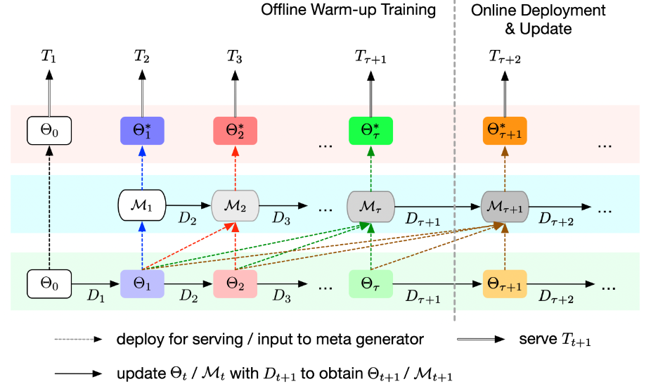
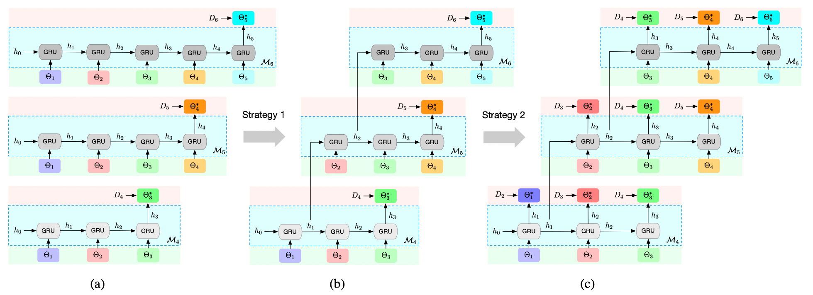
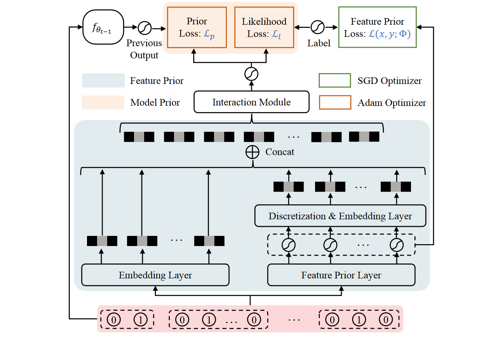
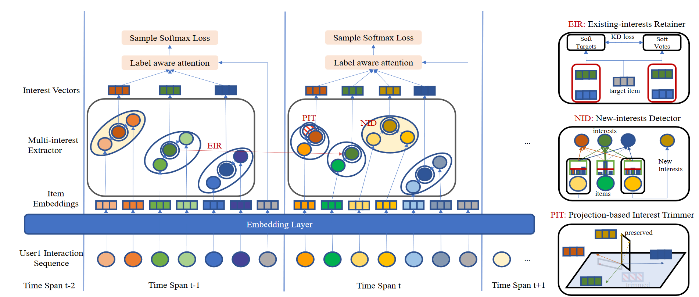
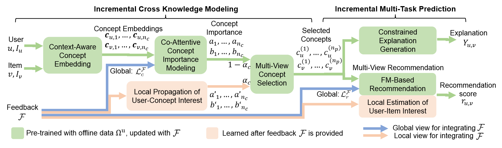

### 1. Learning an Adaptive Meta Model-Generator for Incrementally Updating Recommender Systems

* **推荐任务** ：增量推荐
* **选自** ：Recsys2021
* **解决的问题** ：增量学习中的过拟合和灾难性遗忘问题
* **思路和模型** ：

  - 思路：
    - 增量数据与原模型使用的数据不同分布时，会产生灾难性遗忘问题。
    - 相比持续学习强调在不牺牲之前任务比表现的情况下有效应对新任务，而在推荐任务中更多关注未来的任务。
    - 现有基于模型的增量方法没有考虑模型演化中存在的长期序列模式的潜力。
  - 模型：自适应序列模型生成(Adaptive Sequential Model Generation, ASMG)框架
    
    - 使用随机初始化或预训练生成一个初始模型，之后利用多次的增量进行迭代，得到不同的增量模型，当前周期的增量训练后，使用元学习器根据包括当前周期模型在内的k个历史增量模型，生成更好的模型进行服务。
    - 采用GRU实现元生成器，从而捕获长期依赖。
      
    - 每个周期都使用所有历史增量序列训练是不现实的，而选取截断的序列又会导致历史信息的遗忘。因此在每个增量训练周期开始时，使用上个周期学习到的隐藏状态作为该周期元生成器的初始隐藏状态，从而在使用截断序列训练元生成器时不会丢掉历史信息。
    - 同时训练多个更新周期中的GRU，从而能够并行计算。
* **实验数据集** ：

  * Tmall
  * Sobazaar
  * MovieLens
  * Lazada

### 2. An Incremental Update Framework for Online Recommenders with Data-Driven Prior

* **推荐任务** ：CTR预估
* **选自** ：CIKM2023
* **解决的问题** ：仅利用最新数据进行增量更新容易丢掉长期信息，降低推荐性能。
* **思路和模型** ：
  * 思路：
    * 数据分布发生变化时，传统基于滑动窗口的增量更新策略容易对最新数据产生过拟合。
    * 现有工作多是利用基于模型的方法直接预测每个实例的点击率来解决这个问题，忽视了对数据特征的分析。
    * 大部分数据存在极端稀疏性和特征多样性，导致难以进行准确的偏好估计，模型收敛速度慢。
    * 特征是影响模型效果的最重要因素，找到合适的方式合并特征能带来小姑提升。
    * CTR值在特征级别上的分布比在实例级别上的更稳定，因此在特征级别上进行预估CTR有助于快速收敛。
  * 模型：具有数据驱动先验(Data-Driven Prior, DDP)的在线推荐增量更新框架
    
    * **特征先验FP**：对每个特定特征值进行CTR估计，因为相比频繁变动的实例级别分布，特征级别的分布更加稳定，因此可以增强训练过程的稳定性性；同时由于一个项目一般会具有多个特征，基于特征的预估也能更好地对长尾问题中的尾部项目做出评估。
      * 设置一个所有稀疏特征的先验嵌入向量，通过基于最大似然估计的特征先验损失，更新每个特征的CTR估计值。
      * 将得到的CTR估计值进行离散化得到一个one-hot向量，再与一个嵌入矩阵相乘得到先验特征的稠密嵌入。
      * 将原始特征编码和得到的先验特征嵌入拼接，实现特征先验与原始嵌入模块的结合。
    * **模型先验MP**：使用极大似然估计，基于增量数据更新模型参数，并在拟合增量数据的同时，限制新模型和上一增量更新周期模型的距离，来近似完整数据的后验分布。
    * 是一个与模型无关的框架，可以容纳各种高级交互模型。
* **实验数据集** ：
  * Criteo
  * CIKM2019

### 3. Incremental Learning for Multi-Interest Sequential Recommendation

* **推荐任务** ：序列推荐
* **选自** ：ICDE2023
* **解决的问题** ：多兴趣序列推荐任务中的增量问题
* **思路和模型** ：
  * 思路：
    * 从之前的训练中提取的用户兴趣不是固定的，可能随着时间的推移而变化。
    * 新兴趣的产生是随机且不均匀的，可能短时间内产生大量的新兴趣。
    * 如何处理新旧兴趣的相互干扰，或灾难性遗忘，是待解决的关键问题。
    * 基于**正则化**的增量学习方法无法扩展模型复杂度，从而不能针对新兴趣生成新的兴趣向量。
    * 基于**模型扩展**的方法需要人为设定每次扩展的容量，而增量兴趣在时间上是分布不均的。
  * 模型：增量多兴趣顺序推荐(Incremental Multi-interest Sequential Recommendation, IMSR)
    
    * 基础模型：基于动态路由或自注意力的多兴趣推荐模型
    * 兴趣保留器：使用蒸馏损失确保增量微调后的现有兴趣向量与其原始位置相距不远。
      * 将兴趣视为多个项目类别，从而将目标项目偏好的评分任务转换为基于匹配的分类任务；将现有的兴趣向量视为教师模型的参数，待学习的新兴趣向量看做学生模型的参数。在此基础上使用最小化蒸馏损失的方式得到新的基础模型。
    * 新兴趣检测器：根据分类到不同兴趣的项目编号的分布变化来确定创建新兴趣的时机。
      * 利用查询(Query)矩阵的注意力概率分布和均匀分布之间的KL散度来选择最主要的<项目-兴趣>嵌入对，使用两者的点积表示“项目困惑度”。也即当新的项目与现有兴趣向量的点积结果都相似时，表明该项目无法被划分到现有的任何一个兴趣中，此时才以该项目为基础创建新的兴趣向量。
    * 兴趣修剪器：基于投影的方法增强传统微调策略，通过修改学习到的兴趣向量的大小和方向以去除冗余兴趣。
      * 创建K个新的初始兴趣向量：固定每次创建的新兴趣向量的个数会产生冗余。
      * 只保留与现有兴趣向量平面正交的部分新兴趣向量：如果一个新兴趣向量接近现有的兴趣向量平面，那新向量就可以通过平面内的现有向量线性组合近似，从而不需要创建新的兴趣向量
      * 使用L2范数对兴趣向量做进一步裁剪。
* **实验数据集** ：
  * Amazon Electronics
  * Amazon Clothing
  * Amazon Books
  * Taobao

### 4. Towards Explainable Conversational Recommendation

* **推荐任务** ：对话推荐
* **选自** ：IJCAI2021
* **解决的问题** ：对话推荐中的解释
* **思路和模型** ：

  * 思路：
    * 增强推荐的可解释性可以提高用户满意度、信任度和效率。
    * 相比通过设置特定问题来主动需求用户反馈，对推荐的原因给出解释能减少用户的交互负担。
    * 现有方法侧重于提供单轮解释，缺乏纳入用户反馈的能力。
  * 模型：针对可解释的对话推荐(Explainable Conversational Recommendation, ECR)的增量多任务学习框架
    
    * 增量交叉知识建模：学习在解释任务和推荐任务中传递的交叉知识，并阐明如何使用增量学习来更新交叉知识。

      * **上下文感知概念嵌入**：利用Microsoft Concept Graph提取项目对应的概念，将与某个概念相关的评论嵌入取平均，得到上下文嵌入，将上下文嵌入拼接在概念的词嵌入后得到上下文感知嵌入。
      * **协同注意力概念重要性建模**：针对用户和项目的概念嵌入，计算协同注意力权值矩阵，协同注意力权重的高低体现了其重要程度，决定了对应概念出现在系统给出的解释中的概率大小。
      * **<用户-概念>兴趣局部传播**：根据概念嵌入和用户反馈提供的标签聚合嵌入计算概念的偏好评分。
      * **多视图概念选择**：使用直通的Gumbel-Softmax代替离散的argmax的操作，从候选概念中选取最重要的概念，从而避免模型不可微；使用不同初始噪声和协同注意力矩阵进行n次Gumbel运算得到n个最重要的概念。
    * 增量多任务预测：基于交叉知识生成解释，并结合交叉知识和用户反馈预测推荐分数。

      * **多视图推荐**：使用因式分解机预测**全局推荐分数** ；通过判断用户反馈中是否包括了关键概念，计算**局部推荐分数** 。最后将两者进行加权，得到多视图推荐分数。
      * **约束解释生成**：使用基于GRU的双向生成方法，限制解释中必须出现选定的概念，从而对输出的解释做出**硬约束** ；通过引入概念相关性损失，选定概念在解释中缺失的越多损失值越高，从而对解释做出**软约束** 。
* **实验数据集** ：

  * Electronics
  * Movie&TV
  * Yelp
